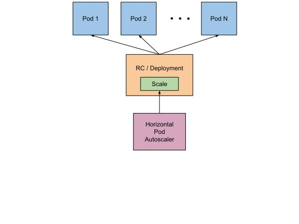
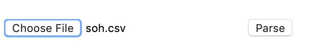
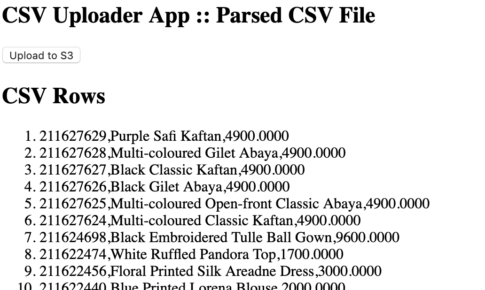
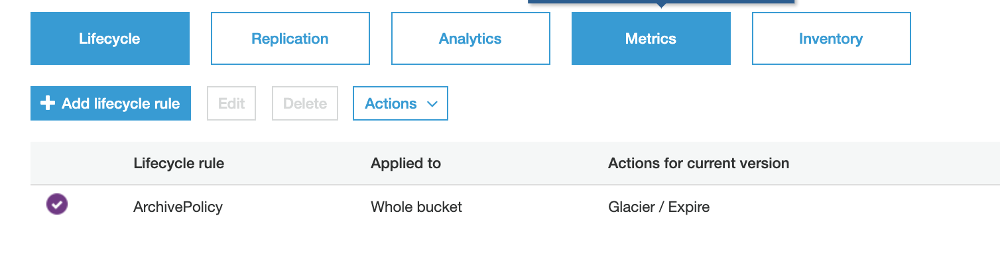

# Sample Scalable Application on Kubernetes Cluster

> A web application, written in NodeJS to upload, parse and process CSV files and store in S3 Bucket.

## What's needed

* [Kubctl](https://kubernetes.io/docs/tasks/tools/install-kubectl/)
* [Minikube](https://github.com/kubernetes/minikube)

## Development

* Cloning the repo

```bash
$ git clone https://github.com/danishbacker/atg-test-01
```

* Installing dependencies

```bash
$ npm install
```

## Docker

* Building an image

```bash
$ docker login
$ docker build -t danishbacker/atg-test-01:prod .
```

* Running containers

```bash
$ docker run -it -p 49162:3000 -d danishbacker/atg-test-01:prod
```

* Push build to dockerhub

```bash
$ docker push danishbacker/atg-test-01:prod
```

* Stop all containers
```bash
$ docker stop $(docker ps -a -q)
```

## Docker Nginx Config
##### Note: Not working for Kubernetes deployment 
##### TODO: Update Kubernetes Deployment and Service

* Building an image

```bash
$ docker-compose build
```

* Running containers

```bash
$ docker-compose up
```

* Stopping  containers

```bash
$ docker-compose down
```

## Infrastructure

* Starting minikube with hyperkit (recommened for mac)

```bash
$ minikube start --vm-driver=hyperkit
```

* Apply 

```bash
$ minikube start --vm-driver=hyperkit
```

* Create or update Deployment and Serivce on Kubernetes

```bash
$ kubectl apply -f k8s
```

* Update Deployment or Serivce individually

```bash
$ kubectl apply -f k8s/service.yml
```

* Check deployment and services 

```bash
$ kubectl get services
$ kubectl get delpoyments
$ kubectl get pods
```

* Start minikube dashboard

```bash
$ minikube dashboard
```

* Open application in browser

```bash
$ minikube service atg-test-01
```

* Delete minikube

```bash
$ minikube stop
$ minikube delete
```

## Test Deployment Scaling

* Test application scaling using Apache Benchmark (Note: installed by default in mac).
```bash
$ kubectl get hpa
$ ab -c 5 -n 100 -t 1000 http://<cluster-ip-addresss>:30003/
```

## Auto scaling diagram



## App Screens

> Home page


> File Upload



> Parse and store in S3 bucket



> Bucket Policy overview



> Bucket Policy details 

